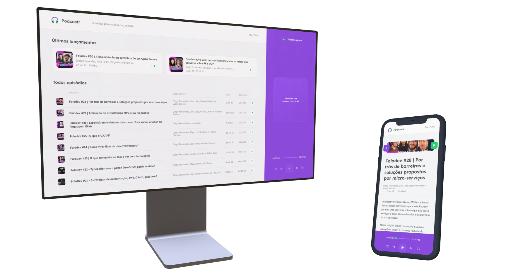
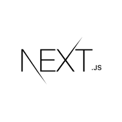
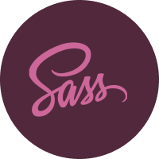

  
  

## About
<strong>Podcastr</strong> is a podcast platform about tech. The project was built during the Next Level Week event created by [Rocketseat](https://www.rocketseat.com.br/).

## Technologies

### React

### Next.js

### Typescript

### Sass

## How to use it
1. Clone the project with `git clone https://github.com/Eduardo-H/podcastr.git`
2. Enter the project's directory using `cd podcastr/`
3. Install the project's dependencies by running `yarn` on the terminal
4. Open a new terminal window and run the local server wiht `yarn server`
5. Run the project with `yarn`

PS: The server must be running for the application to work.